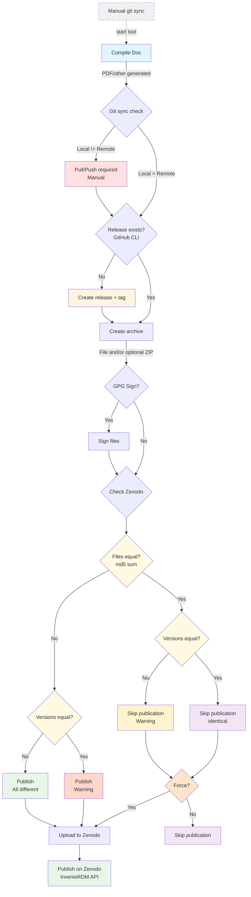

# Zenodo Publisher

A lightweight local CLI tool for publishing LaTeX and compiled projects to [Zenodo](https://zenodo.org/) from git repo. Designed for frequent, rapid releases by a single maintainer.


## Why This Tool?

GitHub Actions like [rseng/zenodo-release](https://github.com/rseng/zenodo-release) or [megasanjay/upload-to-zenodo](https://github.com/megasanjay/upload-to-zenodo) work well for collaborative projects, but we wanted:

- **Local control**: No isolated CI environment - everything runs locally where your LaTeX setup already works
- **Predictable timing**: No cache invalidation delays that sometimes slow down GitHub Actions unpredictably. Even if, timing depends on the API itself, but no more middleman
- **Step-by-step feedback**: Console output shows exactly what's happening at each stage
- **Single maintainer workflow**: Optimized for one person handling releases while others contribute code

This tool is **not recommended** for highly collaborative projects where multiple people need to trigger releases. For that, use GitHub Actions.

# Publication workflow


```mermaid
graph TD
    Z[Manual git sync] -.->|start tool| A
    A[Compile Doc] -->|PDF/other generated| B{Git sync check}
    B -->|Local != Remote| C[Pull/Push required <br/> Manual]
    B -->|Local = Remote| D{Release exists? <br/> GitHub CLI}
    C --> D
    D -->|No| E[Create release + tag]
    D -->|Yes| F[Create archive]
    E --> F
    F -->|File and/or optional ZIP| F2{GPG Sign?}
    F2 -->|Yes| F3[Sign files]
    F2 -->|No| G{Check Zenodo}
    F3 --> G{Check Zenodo}
    G --> H{Files equal? <br/> md5 sum}
    H -->|Yes| I{Versions equal?}
    H -->|No| J{Versions equal?}
    I -->|Yes| K[Skip publication <br/> identical]
    I -->|No| L[Skip publication <br/> Warning]
    J -->|Yes| M[Publish <br/> Warning]
    J -->|No| N[Publish <br/> All different]
    K --> O{Force?}
    L --> O
    O -->|Yes| P[Upload to Zenodo]
    O -->|No| Q[Skip publication]
    M --> P
    N --> P
    P --> R[Publish on Zenodo <br/> InvenioRDM API]

    style Z fill:#f0f0f0,stroke-dasharray: 5 5
    style A fill:#e1f5ff
    style E fill:#fff4e1
    style R fill:#e8f5e9
    style Q fill:#f3e5f5
    style K fill:#f3e5f5
    style L fill:#fff3cd
    style C fill:#ffe0e0
    style H fill:#fff9e1
    style I fill:#fff9e1
    style J fill:#fff9e1
    style M fill:#ffd6cc
    style N fill:#e8f5e9
    style O fill:#ffe4cc
```

You can publish only the zip of the project or add a dynamic compilation (through makefile) to include another file on the zenodo repo (but not included in the git repo). Typically, project having both source paper and source code inside a single git repo but does not want to have the compiled pdf file in the git tree.

## Prerequisites

- **Python 3.10+**
- **uv** (Python package manager): https://docs.astral.sh/uv/
- **GitHub CLI** (`gh`): https://cli.github.com/ - used for creating GitHub releases
- **Existing Zenodo deposit**: The script creates new versions, not new deposits. You must manually create the first version on Zenodo.
- **GnuPG** (optional): Required only if signing is enabled in config. Must have at least one secret key in your keyring.
- If using **LaTeX distribution**, prefer using `latexmk` as it handles citation/reference as error. But we can use whatever you want.

## Installation

```bash
# Clone or copy this tool somewhere
git clone <repo-url> zenodo-publisher
cd zenodo-publisher
```

Install the tool globally

```bash
# Or install globally
uv tool install .
```

Or locally by running the `bash` launcher
```bash
uv sync
```

Then
```bash
chmod +x zp.bash
```

## Usage

```bash
# From your project directory (where zenodo_config.yaml is located)
zp
# or zp.bash or any symlink to the bash launcher if the tool is not installed globally
zp --help
```

Then use the script at the root of your project.

You have a functioning example of such a project repo [here](https://github.com/weberBen/zenodo-sandbox-publisher). See the associated readme for instruction.

## Commands

### `zp` / `zp release` -- Full release pipeline

Runs the full release pipeline (git check, GitHub release, compile, archive, Zenodo publish). This is the default behavior when no subcommand is specified.

```bash
zp                     # default (release)
zp release             # explicit subcommand
zp release --debug     # with flags
```

### `zp archive` -- Create a standalone archive

Creates a zip archive of the project at a given git tag using `git archive`, and prints checksums. Does **not** require the full Zenodo pipeline.

```bash
# Inside a ZP project (reads project_name from zenodo_config.yaml)
zp archive --tag v1.0.0
zp archive --tag v1.0.0 --output-dir

# --no-cache: fetch the tag from the remote origin instead of using the local repo
zp archive --tag v1.0.0 --no-cache

# --remote: archive from any remote git repository (no zenodo_config.yaml needed)
zp archive --tag v1.0.0 --project-name-prefix MyProject --remote git@github.com:user/repo.git
```

| Flag | Required | Default | Description |
|------|----------|---------|-------------|
| `--tag` | Yes | -- | Git tag to archive |
| `--project-name-prefix` | No* | config or dir name | Project name used as archive prefix. *Required with `--remote` outside a git repo |
| `--output-dir` | No | Temporary directory | Output directory for the archive |
| `--remote` | No | -- | Git remote URL (shallow clone instead of local repo) |
| `--no-cache` | No | `False` | Fetch the tag from the remote origin |
| `--format` | No | `zip` | Archive format: `zip`, `tar`, or `tar.gz` |
| `--hash-algo` | No | `sha256` | Hash algorithms (comma-separated, e.g. `sha256,md5`) |

> **Important -- project name and checksums:** The project name is embedded in the archive prefix (`ProjectName-tag/`). Changing the project name changes the archive content and therefore its MD5/SHA256 checksums. If you want to compare a locally-created archive with the one published on Zenodo, you **must** use the exact same project name that was configured when the archive was published to Zenodo.
> This does not apply for tree/tree256 hash which only compute content.

> **Standalone script:** For a lightweight alternative that doesn't require the full tool, the [`remote_repo_to_archive.sh`](./examples/remote_repo_to_archive.sh) script fetches a git archive (ZIP) from any remote repository at a given tag or commit (without cloning the full history as for the ZP script).

## Project Setup

### 1. Create `zenodo_config.yaml` in your project root

This is the main configuration file. All options except sensitive credentials go here.

```yaml
project_name:
  prefix: "MyProject"
  suffix: "-{tag_name}"       # available: {tag_name}, {sha_commit}

main_branch: main

compile:
  enabled: true
  dir: papers/latex           # relative to project root
  # make_args: ["-j4"]        # extra args for make

archive:
  format: zip                 # zip, tar, or tar.gz
  dir: papers/latex/releases  # persistent archive directory (optional)
  # tar_extra_args: []        # override default reproducible tar args
  # gzip_extra_args: []       # override default gzip args

hash_algorithms: [md5, sha256, tree]

signing:
  sign: true
  # sign_mode: file_hash      # file (sign file directly) or file_hash (sign hash of file)
  # gpg:
  #   uid: "key@example.com"  # GPG key UID (optional, default key if omitted)
  #   extra_args: ["--armor"] # default, use ["--no-armor"] for binary .sig

zenodo:
  api_url: "https://sandbox.zenodo.org/api"  # use https://zenodo.org/api for production
  concept_doi: "432538"
  # publication_date: "2024-01-15"  # defaults to today UTC
  # force_update: false

github:
  check_draft: false          # reject tags associated with draft releases (slow, scans all releases)

generated_files:
  paper:
    pattern: "main.pdf"       # glob pattern matched in compile_dir
    # rename: true            # rename to ProjectName-tag.pdf
    # sign: true              # per-file signing override
    # sign_mode: file         # per-file sign mode override (file or file_hash)
    # archive_types: [file]   # override global archive.types ([] = do not persist)
    publishers:
      destination:
        file: [github, zenodo]
        # sig: [zenodo]       # where to upload the GPG signature

  myfile:
    # handle all files individually that match the pattern
    pattern: "*.md"
    publishers:
      destination:
        file: [zenodo]

  project:
    publishers:
      destination:
        file: [zenodo]

  manifest:
    content:                  # which entries/types to include in the manifest JSON
      paper: [file, sig]      # include paper + its signature hash
      project: [file]         # include project file hash
      myfile: [file]
    commit_info: [sha, date_epoch]
    zenodo_metadata: [title, creators]
    sign: true
    publishers:
      destination:
        file: [zenodo, github]
        sig: [zenodo, github]

prompt_validation_level: danger  # danger, light, normal, secure
```

### 2. Create `.zenodo.env` in your project root (sensitive vars only)

```env
ZENODO_TOKEN=your_zenodo_api_token
ZENODO_CONCEPT_DOI=123456
```

Only sensitive variables go here. Everything else is in `zenodo_config.yaml`.

These variables can also be passed via environment variables (e.g. `export ZENODO_TOKEN=...`). Environment variables take priority over `.zenodo.env`. The full resolution order is: CLI > YAML > os environment > `.zenodo.env` > defaults.

Create a Zenodo token on `account/settings/applications/tokens/new/` (tokens created on [Zenodo sandbox](https://sandbox.zenodo.org/) are separate from production) and allow `deposit:actions` and `deposit:write`.

### 3. Create a Makefile in your compile directory

The script calls `make deploy` in the directory specified by `compile.dir`. Your Makefile must have a `deploy` target:

```makefile
.PHONY: deploy
deploy: cleanall all
```

See [`Makefile.example`](./examples/Makefile.example) for a complete template.
For latex project, we recommend doing a deep clean (including the pdf) on the deploy action to handle possible outdated version artifact.
You can also disable compilation (`compile.enabled: false`) in case of too long comp time. But be aware that in case of missing compiled file, the script will raise exception.

##### Notes

- LaTeX is optional.
- If your project includes no latex at all and you're not interested in pdf archive and/or dynamic compilation, set `compile.enabled: false` and only use `project` in `generated_files`. Or a `pattern` entry in `generated_files` pointing to your file.

#### Environment variables passed to `make`

The script passes the following environment variables to `make deploy`, containing information about the commit being released:

| Variable | Description |
|----------|-------------|
| `ZP_COMMIT_DATE_EPOCH` | Unix epoch timestamp of the commit |
| `ZP_COMMIT_SHA` | Full SHA hash of the commit |
| `ZP_COMMIT_TAG` | Tag name (set by the pipeline to the release tag) |
| `ZP_COMMIT_SUBJECT` | Commit message subject line |
| `ZP_COMMIT_COMMITTER_NAME` | Name of the committer |
| `ZP_COMMIT_COMMITTER_EMAIL` | Email of the committer |
| `ZP_COMMIT_AUTHOR_NAME` | Name of the author |
| `ZP_COMMIT_AUTHOR_EMAIL` | Email of the author |
| `ZP_BRANCH` | Current branch name |
| `ZP_ORIGIN_URL` | Remote origin URL |
| `ZP_TAG_SHA` | Tag object SHA (differs from commit SHA for annotated tags) |

All variables are prefixed with `ZP_` to avoid collisions with git's own environment variables (e.g. `GIT_AUTHOR_NAME`).

##### Reproducible PDFs with `SOURCE_DATE_EPOCH`

For LaTeX projects, you can set `SOURCE_DATE_EPOCH` from `ZP_COMMIT_DATE_EPOCH` at the top of your Makefile:

```makefile
ifdef ZP_COMMIT_DATE_EPOCH
export SOURCE_DATE_EPOCH ?= $(ZP_COMMIT_DATE_EPOCH)
endif
```

When `SOURCE_DATE_EPOCH` is set, pdflatex/lualatex automatically use this date for `\today` and PDF metadata instead of the current time. This makes the PDF reproducible: running the script twice on the same commit produces the same PDF with the same MD5 checksum.

### 4. Configure LaTeX for reproducible PDFs

For MD5 checksum comparison to work correctly, your PDFs must be reproducible. Add these lines to your `.tex` file:

```latex
\pdfinfoomitdate=1
\pdfsuppressptexinfo=-1
\pdftrailerid{}
```

This is highly recommended, not mandatory, but without these the only reference point between the git repo and the zenodo repo will be the version tag name. With this option, we can also compare the content of the previous version to make sure files are different.

## How It Works

### Release pipeline

1. **Git check**: verifies you're on `main_branch`, branch is up-to-date with remote (no local modifications, no unpushed commits, no unpushed tags, remote not ahead)
2. **Release check/creation**: checks if latest commit already has a GitHub release. If not, prompts for tag name, title, notes and creates the release via `gh release create`
3. **Commit info**: retrieves commit metadata (SHA, timestamp, author, etc.) as ZP_* environment variables
4. **Project name**: resolves the `{tag_name}` and `{sha_commit}` template variables
5. **Compile**: runs `make deploy` in `compile.dir` (optional, skipped if `compile.enabled: false`). ZP_* vars are passed as environment
6. **Re-check**: verifies git state and release are still valid after compilation
7. **Resolve generated files**: scans project dir for files matching `pattern` globs (default path suffix is compile dir)
8. **Archive**: copies/renames PATTERN files, creates PROJECT archive via `git archive`
9. **Compute hashes**: computes md5, sha256, and any extra algorithms from `hash_algorithms`
10. **Manifest**: generates JSON manifest (JCS/RFC 8785) with file hashes included, then the manifest itself is hashed
11. **Sign**: GPG signing per-file (FILE or FILE_HASH mode), creates `.asc` or `.sig` files
12. **Compute identifiers**: per-file alternate identifiers pushed to Zenodo metadata (`metadata.identifiers`), computed from the file hash (e.g. `sha256:abc123...`)
13. **Publish**: routes each file to zenodo and/or github based on `publishers` config
14. **Persist**: copies files to `archive.dir/{tag_name}/`


This tool uses `git fetch` (not in dry run mode). If fetching regularly is a problem for your project, do not use this tool.

### Re-running after a failure

The pipeline is designed to be **re-run safely** after a failure. Each step handles pre-existing state:

- **Step 2 (Release)**: if the GitHub release and tag already exist from a previous run, the pipeline detects that the latest commit is already released and **skips creation**. It reuses the existing tag and continues.
- **Step 5 (Compile)**: `make deploy` runs again from scratch. If your Makefile is idempotent, the output will be the same.
- **Step 8 (Archive)**: files are always created in a **fresh temporary directory**, so there is no conflict with a previous run.
- **Step 13 (Publish to Zenodo)**: compares the version name and MD5 checksums of local files against the latest Zenodo record. If everything matches, publication is **skipped** (unless `zenodo.force_update: true`). Signature files (.asc/.sig) are excluded from the comparison because GPG signatures contain a timestamp that changes on every run.
- **Step 13 (Publish to GitHub)**: compares the SHA256 digest of local files against existing release assets. If identical, the asset is **skipped**. If different, the user is prompted before overwriting (via `gh release upload --clobber`).
- **Step 14 (Persist)**: if the archive directory already contains files from a previous run, the user is prompted before overwriting.

In short: re-running `zp release` after a failure will pick up where it left off. The release and tag are reused, unchanged files are skipped, and you are prompted before any overwrite.

### Prompt validation level

The `prompt_validation_level` setting controls how much confirmation is required at each interactive prompt. It affects three prompts: **build confirmation**, **publish confirmation**, and **GitHub asset overwrite**.

| Level | What the user types | Use case |
|-------|-------------------|----------|
| `danger` | Just press **Enter** | Fast iteration during development or testing. No protection against accidental confirmation. |
| `light` | Type **y** or **yes** | Default for most workflows. Quick but intentional. |
| `normal` | Type the full word **yes** | Extra caution for production releases. |
| `secure` | Type the **exact project root directory name** | Maximum protection. Prevents accidental publication to the wrong project. |

Two prompts are **not affected** by this setting and have fixed levels:
- GPG key confirmation: always `danger` (Enter to accept, since the key info is displayed)
- Persist overwrite: always `light` (y/yes, with "yes to all" / "no to all" options)

### File renaming (`rename` option)

When `rename: true` is set on a `generated_files` entry, the matched file is renamed using the resolved project name:

```
original: main.pdf  →  renamed: MyProject-v1.0.0.pdf
```

The pattern is `{project_name}{original_extension}`, where `project_name` is built from `project_name.prefix` + `project_name.suffix` with template variables resolved (e.g. `{tag_name}` becomes `v1.0.0`).

If a glob pattern matches multiple files with the **same extension**, the original filename is appended as suffix to avoid collisions:

```
a.pdf               →  MyProject-v1.0.0.pdf          (only PDF, no suffix)
b.txt               →  MyProject-v1.0.0_b.txt        (two .txt, suffix added)
c.txt               →  MyProject-v1.0.0_c.txt
d.ko                →  MyProject-v1.0.0_d.ko         (two .ko, suffix added)
j.ko                →  MyProject-v1.0.0_j.ko
```

Files with a unique extension keep the clean `{project_name}{ext}` name. Only files sharing an extension get the `_{original_stem}` suffix.

Applies to **pattern** and **project** entries. For `project`, `rename: true` uses the project name as archive prefix (e.g. `MyProject-v1.0.0.zip`), while `rename: false` (default) uses the repository directory name (e.g. `my-repo.zip`).

If two files end up with the same destination name (e.g. same-name files from different directories with `rename: false`), the pipeline fails with `pipeline.archive.collision` instead of silently overwriting.

### Generated files

The `generated_files` section in `zenodo_config.yaml` declares which files to include in the release. Three types:

- **pattern entries** (custom key): a file matched by glob pattern. Can be renamed using the project name template.
- **project** (reserved key): a git archive of the repository. Format controlled by `archive.format`.
- **manifest** (reserved key): a JSON manifest in canonical format (JCS/RFC 8785) listing file hashes, commit info, and optional metadata.

Each entry can specify:
- `sign`: per-file signing override (overrides global `signing.sign`)
- `sign_mode`: per-file signing mode override
- `rename`: rename using project name template (default: false)
- `archive`: persist to `archive.dir/{tag}/` after the run (default: true). Set to `false` to publish without local copy. Signatures inherit this setting from their parent file.
- `publishers.file_destination`: where to upload the file (`zenodo`, `github`, or both). Default: `[zenodo]`
- `publishers.sig_destination`: where to upload the `.asc`/`.sig` signature (`zenodo`, `github`, or both). Default: `[]` (not uploaded). Requires `sign: true` on the entry
- `identifier`: compute an alternate identifier pushed to Zenodo metadata (`metadata.identifiers`). The hash algorithm used is `signing.sign_hash_algo` (not `hash_algorithms`). Format: `zp:///{filename};{algo}:{hex}` (e.g. `zp:///MyProject-v1.0.0.json;sha256:abc123...`). Options:
  - `source: file` (default): hash of the file itself
  - `source: sig_file`: hash of the signature (requires `sign: true`)
  - Glob patterns with `*` (multi-match) cannot have an identifier (ambiguous: which matched file to use?)
  - All ZP-generated identifiers use the `zp:///` scheme. On each run, existing `zp:///` entries on Zenodo are removed and replaced with the current ones

#### Pattern path resolution

Patterns are **always** resolved relative to **project root**, never `compile.dir`. Setting `compile.dir` does not change where patterns are matched. To match files inside the compile directory, you must use the `{compile_dir}` template variable explicitly in the pattern:

```yaml
compile:
  dir: papers/latex

generated_files:
  paper:
    pattern: "{compile_dir}/main.pdf"    # matches <project_root>/papers/latex/main.pdf
  data:
    pattern: "data/results.csv"          # matches <project_root>/data/results.csv
  report:
    pattern: "main.pdf"                  # matches <project_root>/main.pdf (NOT papers/latex/main.pdf)
  nested:
    pattern: "*ape*/*/*.pdf"             # wildcards in directory segments
  all_logs:
    pattern: "**/*.log"                  # recursive matching at any depth
```

Patterns support standard glob wildcards in any segment of the path: `*` (any chars), `?` (single char), `**` (recursive), `[...]` (char sets). Patterns starting with `/` are treated as relative to project root (not filesystem root).

`{compile_dir}` is a text substitution: it is replaced by the value of `compile.dir` before glob matching. Without it, the pattern is matched from the project root regardless of what `compile.dir` is set to.

Available template variables:
- `{compile_dir}`: value of `compile.dir` from config (default set to project root)
- `{project_root}`: absolute path to the project root (where `zenodo_config.yaml` is)
- `{project_name}`: resolved at runtime as `prefix + suffix` (e.g. `MyProject-v1.0.0` with `prefix: "MyProject"`, `suffix: "-{tag_name}"`, tag `v1.0.0`)

If a template variable is used but not set (e.g. `{compile_dir}` without `compile.dir` in config), the config will fail with an error.

If a glob pattern matches multiple files (e.g. `*.pdf` matches 3 PDFs), each matched file becomes a separate archived file. In the manifest, each appears as its own entry with independent hashes.

Matched files are copied to the output directory using their **filename only** (no subdirectory structure). If a glob matches files with the same name in different directories (e.g. `dir1/doc.txt` and `dir2/doc.txt`), the copies will collide. Use unique filenames or the `rename` option to avoid this.

#### Pattern overlap detection

Two patterns that could match the same file are rejected at configuration time. This prevents ambiguous file routing (which publisher gets which file?). Examples:

- `*.pdf` and `*.pdf` : rejected (identical)
- `*.pdf` and `main.pdf` : rejected (`main.pdf` is a subset of `*.pdf`)
- `{compile_dir}/*.pdf` and `{compile_dir}/*.pdf` : rejected (same after template resolution)
- `*.pdf` and `*.csv` : accepted (different extensions, no overlap)

### Tag validation

When creating a new release, `check_tag_validity` verifies:
- If tag does not exist: OK, proceed
- If tag exists and points to latest remote commit: OK (tag reuse)
- If tag exists but points to wrong commit: rejected
- Optionnally detect if the tag is associated to a draft GitHub release

### Draft release detection

GitHub draft releases are invisible to `gh release list` and to the `/releases/tags/{tag}` API endpoint. When `gh release create` is called with a tag name that matches an existing draft, GitHub silently converts the draft into a published release.

To prevent this, set `github.check_draft: true` in `zenodo_config.yaml`. This scans all releases via the REST API to detect drafts. It is disabled by default because it requires paginating all releases (slower).

### GPG signing

Signing is configured globally in the `signing` section and can be overridden per-file via `sign` and `sign_mode` in each `generated_files` entry.

Two signing modes:
- **file** (`sign_mode: file`): signs the file directly with GPG. Produces a detached signature.
- **file_hash** (`sign_mode: file_hash`, default): computes the file's hash using `sign_hash_algo`, writes `algo:hexvalue` to a temp file, and signs that text file with GPG. The temp hash file is deleted after signing, only the signature remains.

**Two different hash concepts are involved:**

- **`sign_hash_algo`** (config `signing.sign_hash_algo`, default `sha256`): which hash algorithm is used to compute the file digest in `file_hash` mode. This determines what content GPG actually signs. Changing it (e.g. to `sha512`) changes the signed content and therefore the signature. This is a ZP config option.
- **GPG digest algorithm** (GPG's own `--digest-algo`): which hash GPG uses internally for its own signature computation. This is controlled by GPG itself (via `gpg.conf` or `gpg.extra_args: ["--digest-algo", "SHA512"]`). This is independent from `sign_hash_algo`.

Per-file overrides available in `generated_files` entries:
- `sign: true/false` : enable/disable signing for this file (overrides global `signing.sign`)
- `sign_mode: file/file_hash` : override the signing mode for this file

> **Note**: CLI flags (`--sign`/`--no-sign`, `--sign-mode`, etc.) override the **global** `signing.*` config only. Per-file `sign` and `sign_mode` set in `generated_files` entries are not affected — a file with `sign: true` in its entry will still be signed even if `--no-sign` is passed.

Signature format: `.asc` (ASCII-armored, default) or `.sig` (binary, when `gpg.extra_args` includes `--no-armor`).

The `gpg.extra_args` list is merged with defaults (`["--armor"]`) via `dedup_args`: `--no-armor` removes `--armor`, `--flag=value` overrides `--flag=old`.

### Manifest

When a `manifest` entry exists in `generated_files`, the pipeline generates a JSON file in [JCS (RFC 8785)](https://www.rfc-editor.org/rfc/rfc8785) canonical format containing:

- **Version info**: tag label, tag object SHA (if `tag_sha` in `commit_info`)
- **Commit info**: configurable fields (`sha`, `date_epoch`, `subject`, `author_name`, `author_email`, `branch`, `origin`)
- **File entries**: each listed file with its filename as `key`
- **Optional metadata**: fields from `.zenodo.json` via `zenodo_metadata`

The `files` list references entry keys. To include signatures, append the `_sig` suffix to the entry key:

```yaml
manifest:
  files: [paper, paper_sig, project, project_sig]
  commit_info: [sha, date_epoch]
  sign: true
  publishers:
    file_destination: [github, zenodo]
```

This includes the hashes of the PDF, its signature, the ZIP archive, and its signature in the manifest. The `_sig` suffix is reserved for this purpose and cannot be used as a user-defined key.

The canonical JSON format (JCS) ensures deterministic serialization: the same content always produces the same bytes and therefore the same hash, regardless of key ordering or whitespace.

### Custom modules

Modules are external pipeline steps that run after files are built and hashed, and before publishing. Each module receives a list of files and produces new files (e.g. a timestamp, a certificate) that are then published alongside the originals.

#### Creating a module

Place a Python script at one of these locations (ZP looks in this order):

1. `~/.zenodo/modules/<name>/main.py` — user module (directory form)
2. `~/.zenodo/modules/<name>.py` — user module (single file)

The script is invoked as:

```
uv run <script_path> --input <json_file>
```

The input JSON has the following structure:

```json
{
  "config": {"identity_hash_algo": "sha256"},
  "output_dir": "/tmp/...",
  "files": [
    {
      "file_path": "/path/to/paper.pdf",
      "config_key": "paper",
      "hashes": {"sha256": {"value": "abc...", "formatted_value": "sha256:abc..."}},
      "module_config": {"my_option": true}
    }
  ]
}
```

The script writes NDJSON to stdout:

- Progress events: `{"type": "detail", "msg": "..."}` (or `detail_ok`, `warn`, `error`)
- Final result line: `{"type": "result", "files": [...]}`

Each entry in `files` must have at minimum:

```json
{
  "file_path": "/tmp/.../paper.pdf.tsr",
  "config_key": "paper",
  "module_entry_type": "tsr"
}
```

`config_key` links the produced file back to the parent entry. `module_entry_type` is a sub-type label (free string, used for display). If the module should declare its own publisher destinations, add a `publishers` key — otherwise ZP uses the destination configured in `zenodo_config.yaml` for the module name.

The script can declare dependencies at the top using PEP 723 inline metadata:

```python
# /// script
# requires-python = ">=3.10"
# dependencies = ["requests>=2.28"]
# ///
```

`uv run` resolves and installs them automatically in an isolated environment.

#### Configuring a module

Declare the module globally and attach it to files in `zenodo_config.yaml`:

```yaml
modules:
  my_module:                 # must match the directory/file name in ~/.zenodo/modules/
    my_option: true          # global config passed to the module for every file

generated_files:
  paper:
    pattern: "{compile_dir}/main.pdf"
    modules:
      my_module:             # attach module to this file
        my_option: false     # per-file override (merged over global config)

publishers:
  destination:
    my_module: [zenodo]      # where to upload files produced by my_module
```

The per-file `modules:` key overrides the global `modules:` config for that file only. Both are merged: per-file values take precedence.

### Recommended hash algorithms

```yaml
hash_algorithms: [md5, sha256, tree]
```

- **md5**: matches Zenodo's default file checksum, allowing comparison between local files and the Zenodo record without re-downloading
- **sha256**: cryptographically secure hash for integrity verification
- **tree** / **tree256**: git tree hash (SHA-1 / SHA-256) that depends only on file content, not the archive format. This provides a reproducible content proof that ZIP or TAR archives may not guarantee on their own (see [Content identification with tree hash](#content-identification-with-tree-hash))

### Zenodo checks
- Verifies the version doesn't already exist on Zenodo
- Compares file checksums (MD5) and version names to detect changes

### Zenodo publishing
- Uploads files to Zenodo
- Applies metadata overrides from `.zenodo.json` if present (see below)
- Sets `version`, `publication_date`, and `identifiers`
- Publish ([InvenioRDM API](https://inveniordm.docs.cern.ch/))

### Metadata overrides (`.zenodo.json`)

Place a `.zenodo.json` file at your project root to update Zenodo metadata on each publication. The file follows the [InvenioRDM metadata schema](https://inveniordm.docs.cern.ch/reference/metadata/) (the format used by Zenodo's current API, not the legacy format).

Only the fields present in the file are updated. Missing fields keep their value from the previous version.

- **`version`**: not allowed. The pipeline sets it from the git tag. The process will stop if present.
- **`publication_date`**: allowed. Overrides the config value (with a warning).
- **`identifiers`**: allowed for custom identifiers (URL, ARK, DOI...). The process will stop if any use the `zp:` scheme, which is reserved for pipeline-generated identifiers.

Example `.zenodo.json`:

```json
{
  "metadata": {
    "title": "My Project",
    "description": "<p>A short description.</p>",
    "creators": [
      {
        "person_or_org": {
          "type": "personal",
          "given_name": "John",
          "family_name": "Doe",
          "identifiers": [
            { "scheme": "orcid", "identifier": "0000-0002-1234-5678" }
          ]
        },
        "affiliations": [{ "name": "CNRS" }]
      }
    ],
    "resource_type": { "id": "publication-article" },
    "rights": [{ "id": "cc-by-4.0" }],
    "subjects": [
      { "subject": "physics" }
    ]
  }
}
```

See [`.zenodo.json.example`](./examples/zenodo.json.example) for a more complete template.

> **Note:** This is not the legacy `.zenodo.json` format used by Zenodo's GitHub integration. It uses the InvenioRDM metadata structure directly (e.g. `person_or_org` instead of `name`, `rights` instead of `license`, `resource_type.id` instead of `upload_type`).

### Archive reproducibility

By default, archives are created in **ZIP** format via `git archive`. However, ZIP is **not reproducible**: internal metadata (timestamps, OS flags, compression implementation details) vary between runs, producing different checksums for identical content.

For **reproducible archives** use `tar` or `tar.gz` format:

```yaml
archive:
  format: tar.gz
```

Or

```bash
zp archive ... --format tar.gz
`̀``

**How it works:** The pipeline first creates a ZIP via `git archive` (the only format git natively supports for prefix-based archives), then extracts it and repacks as TAR using deterministic parameters.

Default TAR args:
```python
TAR_DEFAULT_ARGS = [
    "--sort=name", "--format=posix",
    "--pax-option=exthdr.name=%d/PaxHeaders/%f,delete=atime,delete=ctime",
    "--mtime=1970-01-01 00:00:00Z",
    "--numeric-owner", "--owner=0", "--group=0",
    "--mode=go+u,go-w",
]
```

Default gzip args (for `tar.gz`):
```python
GZIP_DEFAULT_ARGS = ["--no-name", "--best"]
```

These defaults follow the [Reproducible Builds](https://reproducible-builds.org/docs/archives/) guidelines and [GNU tar reproducibility recommendations](https://www.gnu.org/software/tar/manual/html_section/Reproducibility.html). They strip all non-deterministic metadata (timestamps, owner info, ordering) so that the same content always produces the same archive.

You can override these defaults with `archive.tar_extra_args` and `archive.gzip_extra_args`, but a warning will be emitted as this may break reproducibility.

> Use `--debug` to see every command executed with its arguments, so you can verify exactly which `tar`/`gzip` invocations are run.

### Git reference and archive reproducibility

`git archive` embeds the **commit ID** in the archive metadata (pax extended headers for TAR, comment field for ZIP), regardless of the reference passed to it (tag name, commit sha). This means the archive bytes depend solely on the commit being archived (not on the type of reference used).

**How git tags work internally:**

- A **lightweight tag** is simply a pointer to a commit. Its "SHA" is the commit SHA itself.
- An **annotated tag** is a separate git object with its own SHA, distinct from the commit it points to. It stores additional metadata: tagger name, date, and message. However, `git archive` dereferences it to the underlying commit before writing the archive.

`git archive` always embeds the **commit ID** in the archive metadata when passed
a commit or tag reference, including annotated tags, which are automatically
dereferenced to their underlying commit
([git-archive docs](https://git-scm.com/docs/git-archive),
[git-get-tar-commit-id docs](https://git-scm.com/docs/git-get-tar-commit-id)).

Thus the practical risk of using a tag name instead of a commit SHA is not a byte-level difference, but a **stability of reference** issue: a tag can be force-pushed to point to a different commit at any time, causing a pipeline to silently archive different content.

### Content identification with tree hash

Even with reproducible TAR archives, hashing the archive file itself ties the identifier to the archive format and parameters. A more robust approach is to **hash the content independently of the archive** using git tree hashes.

A **git tree hash** is a hash of the file tree (content + permissions + file names) that **excludes** commits, tags, and all git metadata. It is computed by initialising a temporary git repository, staging all files, and running `git write-tree`. This produces a deterministic identifier for the content regardless of how it was archived or compressed.

Available tree hash algorithms:
- `tree` -- SHA-1 (git's default object format)
- `tree256` -- SHA-256 (via `git init --object-format=sha256`)

```yaml
hash_algorithms: [sha256, tree, tree256]
```

```bash
# In zp archive:
zp archive --tag v1.0.0 --hash-algo tree,tree256
```

**Why tree hash is the most robust identifier for reproducibility:** It depends only on the actual file content, not on the archive format, compression settings, or any external tooling. Anyone with the same source files can compute the same tree hash, making it ideal for cross-platform verification and long-term content identification.

**Symlink caveat:** Git stores symlinks as-is on Linux/macOS, but on Windows they may be resolved to regular files depending on git and OS configuration. If your project contains symlinks and you need cross-platform reproducibility, be aware that tree hashes may differ between platforms.

**Non-archive files (e.g. PDF):** Files that are not git archives (like compiled PDFs) cannot have a tree hash. For these files, the tool falls back to the corresponding `hashlib` algorithm: `sha1` for `tree`, `sha256` for `tree256`.

**Standalone script:** The [`archive_to_tree_hash.sh`](./examples/archive_to_tree_hash.sh) script lets you compute the git tree hash of any archive (ZIP, TAR, TAR.GZ, ...) outside of the pipeline. This is useful for independently verifying the tree hash of an archive downloaded from Zenodo or GitHub.

## Tests

E2E test suite that runs the real CLI against a GitHub sandbox repo. Tests create real commits, tags, releases, and assets. See [`tests/README.md`](./tests/README.md) for setup and details.

```bash
uv run pytest tests/e2e/ -v
```

## Limitations

### Test on Sandbox First
Always test with `zenodo.api_url: "https://sandbox.zenodo.org/api"` before using production. The script doesn't handle all edge cases.

### Draft Handling
The script **discards existing drafts** on the Zenodo deposit identified by the concept DOI. If you're collaborating on Zenodo through the web interface while using this script, drafts may be lost.

### Zenodo metadata
- Metadata is copied from the previous version. `version`, `publication_date`, and `identifiers` are set by the pipeline.
- Other metadata fields (title, creators, description, keywords, license, ...) can be overridden via a `.zenodo.json` file.
- Each version gets a new DOI (no custom DOI per release)

### First Version Required
You must manually create the first version on Zenodo before using this script. It only creates new versions of existing deposits.

### PDF Storage Philosophy
This tool assumes you **don't store PDFs/compiled files in git**. PDFs are generated on-the-fly before upload. If your PDFs are already in the repository, consider using Zenodo's native GitHub integration instead.

## Troubleshooting

### "Project not initialized for Zenodo publisher"
Create a `zenodo_config.yaml` file in your project root.

### "Compile directory not found"
Check that `compile.dir` points to a valid directory containing your Makefile, and that `compile.enabled: true`.

### "Files are identical/different to version X on Zenodo"
Your PDF hasn't changed. This usually means:
- You forgot to add the reproducible PDF settings
- Build artifacts from a previous build affected the output
- Version tag is the same, so the check update halts here
- Version tag is different but files content is the same so proceeded with new version

### "Files are different" but project hasn't changed
The script detects file differences (MD5) between local archives and Zenodo even though the git project hasn't changed. This is typically caused by non-reproducible PDFs: each compilation embeds the current date/time, producing a different checksum every run.

**Solution**: Set `SOURCE_DATE_EPOCH` from `ZP_COMMIT_DATE_EPOCH` at the top of your Makefile.

This locks `\today` and PDF metadata to the commit date, making the PDF identical across runs. Also make sure you have the [reproducible PDF settings](#4-configure-latex-for-reproducible-pdfs) in your `.tex` file.

### `.zenodo.json` format errors
This tool uses the **new InvenioRDM metadata format**, not the legacy `.zenodo.json` format from Zenodo's GitHub integration. Common mistakes:
- `"name": "Doe, John"` -> use `"person_or_org": { "given_name": "John", "family_name": "Doe" }`
- `"upload_type": "software"` -> use `"resource_type": { "id": "software" }`
- `"license": "mit"` -> use `"rights": [{ "id": "mit" }]`
- `"access_right": "open"` -> not needed (set via `access` at the record level, not in metadata)
- `"keywords": [...]` -> use `"subjects": [{ "subject": "..." }]`

See the [InvenioRDM metadata reference](https://inveniordm.docs.cern.ch/reference/metadata/) for the full schema, or the [example file](./examples/zenodo.json.example).

### Archive checksums differ from Zenodo

The project name is part of the archive prefix (`ProjectName-tag/`), so changing the project name changes the archive content and therefore its MD5 and SHA256 checksums. The project name given to `zp archive` may not match the actual git repository name.

To reproduce the exact same archive as the one on Zenodo, use the **exact same project name** that was configured when publishing.

### GPG signature verification fails on the manifest

The GPG signature is **not** on the manifest file itself : it signs the manifest's **identifier hash**. The identifier is written as `algorithm:hex_value` (e.g. `sha256:a1b2c3...`) into a text file, and that file is what gets signed.

To verify the signature:

1. The identifier file (`identifier-*.txt`) and its signature (`identifier-*.txt.asc` or `.sig`) are persisted alongside the manifest when `sig` and `identifier` is in `PERSIST_TYPES`.
2. Verify directly: `gpg --verify identifier-v1.0.0.txt.asc identifier-v1.0.0.txt`

If you want to verify from scratch (without the persisted identifier file):

1. Compute the manifest hash: for example `sha256sum manifest-v1.0.0.json` (or whichever algorithm is configured)
2. Write `algorithm:hex_value` into a file **with no trailing newline**: `printf 'sha256:abc123...' > identifier.txt` or `echo -n 'sha256:abc123...' > identifier.txt` (note that only using `echo` without `-n` add an extra line break thus result in a different hash)
3. Verify: `gpg --verify identifier-v1.0.0.txt.asc identifier.txt`

The content must match **byte-for-byte** : any extra newline, whitespace or formatting (other than `ascii`) will cause verification to fail.

### GitHub CLI errors
Make sure `gh` is installed and authenticated: `gh auth login`

## AI assistance

For questions about the codebase, configuration, or usage, you can use the [`llms.md`](./llms.md) file as context for an AI agent. It contains a comprehensive reference of the project internals, options, pipeline steps, and subtleties.
