# Zenodo Publisher

A lightweight local CLI tool for publishing LaTeX projects to [Zenodo](https://zenodo.org/) from git repo. Designed for frequent, rapid releases by a singlish maintainer.


## Why This Tool?

GitHub Actions like [rseng/zenodo-release](https://github.com/rseng/zenodo-release) or [megasanjay/upload-to-zenodo](https://github.com/megasanjay/upload-to-zenodo) work well for collaborative projects, but we wanted:

- **Local control**: No isolated CI environment - everything runs locally where your LaTeX setup already works
- **Predictable timing**: No cache invalidation delays that sometimes slow down GitHub Actions unpredictably
- **Step-by-step feedback**: Console output shows exactly what's happening at each stage
- **Singlish maintainer workflow**: Optimized for "one" person handling releases while others contribute code

This tool is **not recommended** for highly collaborative projects where multiple people need to trigger releases. For that, use GitHub Actions.

# Publication workflow

```mermaid
graph TD
    Z[⚙️ Manual git sync] -.->|start tool| A
    A[📄 Compile Doc] -->|PDF/other generated| B{🔄 Git sync check}
    B -->|Local ≠ Remote| C[⚠️ Pull/Push required <br/> Manual]
    B -->|Local = Remote| D{🏷️ Release exists?}
    C --> D
    D -->|No| E[✨ Create release + tag]
    D -->|Yes| F[📦 Create archive]
    E --> F
    F -->|PDF and/or optional ZIP| G{📚 Check Zenodo}
    G --> H{🔐 Files equal?}
    H -->|Yes| I{🏷️ Versions equal?}
    H -->|No| J{🏷️ Versions equal?}
    I -->|Yes| K[✅ Skip publication <br/> identical]
    I -->|No| L[✅ Skip publication <br/>⚠️ Warning]
    J -->|Yes| M[⬆️ Publish <br/>⚠️ Warning]
    J -->|No| N[⬆️ Publish <br/> All different]
    K --> O{🔄 Force?}
    L --> O
    O -->|Yes| P[⬆️ Upload to Zenodo]
    O -->|No| Q[✅ Skip publication]
    M --> P
    N --> P
    P --> R[🎉 Publish on Zenodo]
    
    style Z fill:#f0f0f0,stroke-dasharray: 5 5
    style A fill:#e1f5ff
    style E fill:#fff4e1
    style R fill:#e8f5e9
    style Q fill:#f3e5f5
    style K fill:#f3e5f5
    style L fill:#fff3cd
    style C fill:#ffe0e0
    style H fill:#fff9e1
    style I fill:#fff9e1
    style J fill:#fff9e1
    style M fill:#ffd6cc
    style N fill:#e8f5e9
    style O fill:#ffe4cc
```



You project can 

## Prerequisites

- **Python 3.10+**
- **uv** (Python package manager): https://docs.astral.sh/uv/
- **GitHub CLI** (`gh`): https://cli.github.com/ - used for creating GitHub releases
- (Optional) **LaTeX distribution `latexmk`** (preferred to handle citation/reference error, but we can use what env you want)
- **Existing Zenodo deposit**: The script creates new versions, not new deposits. You must manually create the first version on Zenodo.

## Installation

```bash
# Clone or copy this tool somewhere
git clone <repo-url> zenodo-publisher
cd zenodo-publisher
```

Install the tool globally

```bash
# Or install globally
uv tool install .
```

Or locally by running the `bash` launcher
```bash
uv sync
```

Then
```bash
chmod +x zp.bash
```

## Usage

```bash
# From your project directory (where .zenodo.env is located)
zp
# or zp.bash or any symlink to the bash launcher if the tool is not installed globally
zp --help
```

Then use the script at the root of your project.

You have a functionning example of such a project repo [here](https://github.com/weberBen/zenodo-sandbox-publisher). See the associated readme for instruction.


## Project Setup

### 1. Create `.zenodo.env` in your project root

#### Configuration Options


| Variable | Required | Default | Description |
|----------|----------|---------|-------------|
| `MAIN_BRANCH` | No | `main` | Branch to check for releases |
| `BASE_NAME` | Yes | - | Base name for uploaded preview files (e.g., `MyProject-`) |
| `COMPILE_DIR` | Yes | - | Path to LaTeX directory (relative to project root) |
| `FILE_BASE_NAME` | No | `main` | Name of the main file (with extension) used as default preview by Zenodo |
| `PUBLISHER_TYPE` | Yes | - | Set to `zenodo` to enable publishing |
| `ZENODO_TOKEN` | Yes | - | Your Zenodo API token |
| `ZENODO_CONCEPT_DOI` | Yes | - | Concept DOI of your Zenodo deposit |
| `ZENODO_API_URL` | No | `https://zenodo.org/api` | Use `https://sandbox.zenodo.org/api` for testing |
| `ARCHIVE_TYPES` | No | `pdf` | What to archive: `<extension>`, `project`, or `pdf,project` |
| `PERSIST_TYPES` | No | - | What to save to `ARCHIVE_DIR` (rest goes to temporary dir) |
| `ARCHIVE_DIR` | No | - | Directory to save persistent archives |
| `PUBLICATION_DATE` | No | Current utc date | Publication paper's date (format iso YYYY-MM-DD) |
| `COMPILE` | No | True | Let the script compile latex project. The compiler only use the defined Makefile, so could be anything than only latex |

See example file [here](./zenodo.env.example).

And create a Zenodo token on `account/settings/applications/tokens/new/` (token created on Zenodo sandbox are dissociated from production) and allow `deposit:actions`and `deposit:write`.

Latex project is optional. If your project include no latex at all, and you're not interested in pdf archive and/or dynamic compilation, you can set `COMPILE=False`, `COMPILE_DIR=`, `ARCHIVE_TYPES=project`.
If you want to include a simple pdf (non latex based), set the `COMPILE_DIR` and the `PREVIEW_FILE_NAME`. The script will look for your pdf at `<compile_dir>/<file_base_name>`.
Also, `COMPILE=False`, `ARCHIVE_TYPES=pdf,project`.

### 2. Create a Makefile in your compile directory

The script calls `make deploy` in the directory specified by `COMPILE_DIR`. Your Makefile must have a `deploy` target:

```makefile
.PHONY: deploy
deploy: cleanall all
```

See `Makefile.example` for a complete template.
We recommand doing a clean (even the pdf) on the deploy action to handle possible outdated version artifact. But if your compile time is long enough, once done on your project, you can skip the clean, which will use the already compiled version.

### 3. Configure LaTeX for reproducible PDFs

For MD5 checksum comparison to work correctly, your PDFs must be reproducible. Add these lines to your `.tex` file:

```latex
\pdfinfoomitdate=1
\pdfsuppressptexinfo=-1
\pdftrailerid{}
```

This is highly recommanded, not mandatory, but without theses the only reference point between the git repo and the zenodo repo will be the version tag name. With this option, we can also compare the content of the previous version to make sure files are different. In theory, the version tag is in sync with the git one, but since we can manually edit theses, a backup solution is always appreciated.

## How It Works

### 1. Build LaTeX
Runs `make deploy` in `COMPILE_DIR`. The script **stops on any error**.

### 2. Git Checks
- Verifies you're on `MAIN_BRANCH`
- Checks branch is up-to-date with remote (no unpushed/unpulled commits)
- Checks no local modifications exist

This tool use `git fetch` (not in dry run mode). Thus if it's a problem to fetch regularly in your project, do not use the tool.

### 3. Tag Validation
- If tag doesn't exist: proceeds
- If tag exists: verifies it points to the latest commit on the remote branch

### 4. GitHub Release
Creates a GitHub release using `gh release create`. This automatically creates and pushes the tag.

### 5. Zenodo Checks
- Verifies the version doesn't already exist on Zenodo
- Compares file checksums (MD5) to detect changes
- If version exists with identical files: skips upload

### 6. Archive & Upload
- Creates PDF archive (and optionally project ZIP)
- The project ZIP uses `git archive` ( ≈ same as GitHub's ZIP), so untracked local files are excluded
- Uploads files to Zenodo
- PDF is set as the default preview

## Limitations

### Edge cases

Application mostly vibe coded, not optimized, not really clean, but working and tested multiple times at each steps on different cases in sandbox, nonetheless be sure to test it on your specific usage before using it in production (test it with test git repo, and test sandbox zenodo repo)

### Test on Sandbox First
Always test with `ZENODO_API_URL=https://sandbox.zenodo.org/api` before using production. The script doesn't handle all edge cases.

### Draft Handling
The script **discards existing drafts** on the Zenodo identified deposit by the concept DOI. If you're collaborating on Zenodo through the web interface while using this script, drafts may be lost.

### API Limitations
- Metadata is copied from the previous version. Only `version` and `publication_date` are modified.
- Each version gets a new DOI (no custom DOI per release)

### First Version Required
You must manually create the first version on Zenodo before using this script. It only creates new versions of existing deposits.

### PDF Storage Philosophy
This tool assumes you **don't store PDFs in git**. PDFs are generated on-the-fly before upload. If your PDFs are already in the repository, consider using Zenodo's native GitHub integration instead.


## Troubleshooting

### "Project not initialized for Zenodo publisher"
Create a `.zenodo.env` file in your project root.

### "Compile directory not found"
Check that `COMPILE_DIR` points to a valid directory containing your Makefile.
And check that `COMPILE=True` or `COMPILE=`.

### "Files are identical/different to version X on Zenodo"
Your PDF hasn't changed. This usually means:
- You forgot to add the reproducible PDF settings
- Build artifacts from a previous build affected the output
- Version tag is the same, so the check update halt here
- Version tag is different but files content is the same so proceeded with new version

### GitHub CLI errors
Make sure `gh` is installed and authenticated: `gh auth login`

## To do

- [ ] Integrate `.zenodo.json` file for richer metadata update
