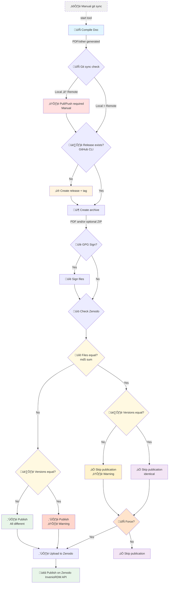

# Zenodo Publisher

A lightweight local CLI tool for publishing LaTeX and compiled projects to [Zenodo](https://zenodo.org/) from git repo. Designed for frequent, rapid releases by a singlish maintainer.


## Why This Tool?

GitHub Actions like [rseng/zenodo-release](https://github.com/rseng/zenodo-release) or [megasanjay/upload-to-zenodo](https://github.com/megasanjay/upload-to-zenodo) work well for collaborative projects, but we wanted:

- **Local control**: No isolated CI environment - everything runs locally where your LaTeX setup already works
- **Predictable timing**: No cache invalidation delays that sometimes slow down GitHub Actions unpredictably. Even if, timing depends on the API itself, but no more middleman
- **Step-by-step feedback**: Console output shows exactly what's happening at each stage
- **Singlish maintainer workflow**: Optimized for "one" person handling releases while others contribute code

This tool is **not recommended** for highly collaborative projects where multiple people need to trigger releases. For that, use GitHub Actions.

# Publication workflow



You can publish only the zip of the project or add a dynamic compilation (through makefile) to include another file on the zenodo repo (but not included in the git repo). Typically, project having both source paper and source code inside a single git repo but does not want to have the compiled pdf file in the git tree.

## Prerequisites

- **Python 3.10+**
- **uv** (Python package manager): https://docs.astral.sh/uv/
- **GitHub CLI** (`gh`): https://cli.github.com/ - used for creating GitHub releases
- **Existing Zenodo deposit**: The script creates new versions, not new deposits. You must manually create the first version on Zenodo.
- **GnuPG** (optional): Required only if `GPG_SIGN=True`. Must have at least one secret key in your keyring.
- If using **LaTeX distribution**, prefer using `latexmk` as it handles citation/reference as error. But we can use whatever you want.

## Installation

```bash
# Clone or copy this tool somewhere
git clone <repo-url> zenodo-publisher
cd zenodo-publisher
```

Install the tool globally

```bash
# Or install globally
uv tool install .
```

Or locally by running the `bash` launcher
```bash
uv sync
```

Then
```bash
chmod +x zp.bash
```

## Usage

```bash
# From your project directory (where .zenodo.env is located)
zp
# or zp.bash or any symlink to the bash launcher if the tool is not installed globally
zp --help
```

Then use the script at the root of your project.

You have a functionning example of such a project repo [here](https://github.com/weberBen/zenodo-sandbox-publisher). See the associated readme for instruction.

## Commands

### `zp` / `zp release` — Full release pipeline

Runs the full release pipeline (git check, GitHub release, compile, archive, Zenodo publish). This is the default behavior when no subcommand is specified.

```bash
zp                     # default (release)
zp release             # explicit subcommand
zp release --debug     # with flags
```

### `zp archive` — Create a standalone archive

Creates a zip archive of the project at a given git tag using `git archive`, and prints checksums. Does **not** require the full Zenodo pipeline.

```bash
# Inside a ZP project (reads PROJECT_NAME from .zenodo.env)
zp archive --tag v1.0.0
zp archive --tag v1.0.0 --project-name MyProject
zp archive --tag v1.0.0 --output-dir ./releases

# --no-cache: fetch the tag from the remote origin instead of using the local repo
# (useful when the tag has not been fetched locally)
zp archive --tag v1.0.0 --no-cache

# --remote: archive from any remote git repository (no .zenodo.env needed)
zp archive --tag v1.0.0 --project-name MyProject --remote git@github.com:user/repo.git
zp archive --tag v1.0.0 --project-name MyProject --remote https://github.com/user/repo.git --output-dir ./out
```

| Flag | Required | Default | Description |
|------|----------|---------|-------------|
| `--tag` | Yes | — | Git tag to archive |
| `--project-name` | No* | `.zenodo.env` or dir name | Project name used as archive prefix. *Required with `--remote` outside a git repo |
| `--output-dir` | No | Temporary directory | Output directory for the archive |
| `--remote` | No | — | Git remote URL — performs a shallow clone instead of using the local repo |
| `--no-cache` | No | `False` | Fetch the tag from the remote origin (avoids touching the local repo) |
| `--format` | No | `zip` | Archive format: `zip`, `tar`, or `tar.gz` |
| `--hash-algo` | No | `sha256` | Hash algorithms for identifiers (comma-separated, e.g. `sha256,md5`) |
| `--hash` | No | — | Additional hash algorithms to display (e.g. `sha512,tree,tree256`) |
| `--work-dir` | No | Current directory | Working directory |

> **Important — project name and checksums:** The project name is embedded in the archive prefix (`ProjectName-tag/`). Changing the project name changes the archive content and therefore its MD5/SHA256 checksums. If you want to compare a locally-created archive with the one published on Zenodo, you **must** use the exact same project name that was configured when the archive was published to Zenodo.

If run inside a ZP project that has `HASH_ALGORITHMS` configured in `.zenodo.env`, the command also prints the identifier hashes for each configured algorithm.

## Project Setup

### 1. Create `.zenodo.env` in your project root

#### Configuration Options


| Variable | Required | Default | Description |
|----------|----------|---------|-------------|
| `PROJECT_NAME` | No | Root dir name | Project name for display and file naming (e.g., `MyProject-v1.0.0.pdf`) |
| `MAIN_BRANCH` | No | `main` | Branch to check for releases |
| `COMPILE_DIR` | Yes | - | Path to compilation directory (relative to project root) |
| `MAIN_FILE` | No | `main.pdf` | Main source file (with extension) renamed as `<PROJECT_NAME>-<version_tag_name>.<extension>` and used as the default preview by Zenodo |
| `COMPILE` | No | `True` | Let the script compile project through `Makefile` |
| `MAKE_ARGS` | No | - | Extra args passed to make (comma-separated, e.g. `-j4,VERBOSE=1`) |
| `PUBLISHER_TYPE` | Yes | - | Set to `zenodo` to enable publishing |
| `ZENODO_TOKEN` | Yes | - | Your Zenodo API token |
| `ZENODO_CONCEPT_DOI` | Yes | - | Concept DOI of your Zenodo deposit |
| `ZENODO_API_URL` | No | `https://zenodo.org/api` | Use `https://sandbox.zenodo.org/api` for testing |
| `ARCHIVE_FORMAT` | No | `zip` | Archive format: `zip`, `tar`, or `tar.gz`. Use `tar`/`tar.gz` for [reproducible archives](#archive-reproducibility) |
| `ARCHIVE_TAR_EXTRA_ARGS` | No | (reproducible defaults) | Extra args for tar, comma-separated (override [default reproducible args](#archive-reproducibility)) |
| `ARCHIVE_GZIP_EXTRA_ARGS` | No | (reproducible defaults) | Extra args for gzip, comma-separated (override default `--no-name,--best`) |
| `ARCHIVE_TYPES` | No | `project` (zip file) | What to archive: `<extension>`, `project`, or `pdf,project` |
| `PERSIST_TYPES` | No | - | What to save to `ARCHIVE_DIR` (rest goes to temporary dir) |
| `ARCHIVE_DIR` | No | - | Directory to save persistent archives |
| `PUBLICATION_DATE` | No | Current UTC date | Publication date (format ISO YYYY-MM-DD) |
| `ZENODO_INFO_TO_RELEASE` | No | `False` | Add zenodo publication info (DOI, URL, checksums) as a GitHub release asset |
| `ZENODO_IDENTIFIER_HASH` | No | `False` | Add hash identifiers in Zenodo metadata (alternate identifiers) |
| `ZENODO_IDENTIFIER_TYPES` | No | - | File types to include in identifier hash (e.g. `pdf`, `project`, `pdf,project`). If multiple, hashes are sorted, concatenated and re-hashed |
| `HASH_ALGORITHMS` | No | `sha256` | Hash algorithms for identifiers (comma-separated, e.g. `sha256,md5`). Any `hashlib` algorithm |
| `DEBUG` | No | `False` | Enable debug mode (shows full stack traces on errors) |
| `PROMPT_VALIDATION_LEVEL` | No | `strict` | Prompt validation level: `strict` (type project name) or `light` (y/n) |
| `ZENODO_FORCE_UPDATE` | No | `False` | Force Zenodo update even if already up to date |
| `GPG_SIGN` | No | `False` | Enable GPG signing of archived files before upload |
| `GPG_UID` | No | - | GPG key UID to use for signing (empty = system default key) |
| `GPG_OVERWRITE` | No | `False` | Overwrite existing signature files without prompting |
| `GPG_EXTRA_ARGS` | No | `--armor` | Extra args passed to gpg (comma-separated). E.g. use `--no-armor` for binary `.sig` |

See example file [here](./zenodo.env.example).

And create a Zenodo token on `account/settings/applications/tokens/new/` (token created on [Zenodo sandbox](https://sandbox.zenodo.org/) are dissociated from production) and allow `deposit:actions`and `deposit:write`.

##### Notes

- Latex is optional.
- If your project include no latex at all, and you're not interested in pdf archive and/or dynamic compilation, you can set `COMPILE=False`, `COMPILE_DIR=`, `ARCHIVE_TYPES=project`.
- If you want to include a simple file (non latex based), set the `COMPILE_DIR` and the `MAIN_FILE`. The script will look for your file at `<COMPILE_DIR>/<MAIN_FILE>`. And also set `COMPILE=False`, `ARCHIVE_TYPES=<my_file_extension>,project`.

### 2. Create a Makefile in your compile directory

The script calls `make deploy` in the directory specified by `COMPILE_DIR`. Your Makefile must have a `deploy` target:

```makefile
.PHONY: deploy
deploy: cleanall all
```

See `Makefile.example` for a complete template.
For latex project , we recommand doing a deep clean (including the pdf) on the deploy action to handle possible outdated version artifact.
But if your base compile time is too long, you can skip the clean, which will use your already compiled file.
You can also disable the compile `COMPILE=False` but be aware that in case of missing compiled file, the script will raise exception.

#### Environment variables passed to `make`

The script passes the following environment variables to `make deploy`, containing information about the commit being released:

| Variable | Description |
|----------|-------------|
| `ZP_COMMIT_DATE_EPOCH` | Unix epoch timestamp of the commit |
| `ZP_COMMIT_SHA` | Full SHA hash of the commit |
| `ZP_COMMIT_TAG` | Tag name (set by the pipeline to the release tag) |
| `ZP_COMMIT_SUBJECT` | Commit message subject line |
| `ZP_BRANCH` | Branch name (set by the pipeline to the main branch) |
| `ZP_COMMIT_COMMITTER_NAME` | Name of the committer |
| `ZP_COMMIT_COMMITTER_EMAIL` | Email of the committer |
| `ZP_COMMIT_AUTHOR_NAME` | Name of the author |
| `ZP_COMMIT_AUTHOR_EMAIL` | Email of the author |

All variables are prefixed with `ZP_` to avoid collisions with git's own environment variables (e.g. `GIT_AUTHOR_NAME`).

##### Reproducible PDFs with `SOURCE_DATE_EPOCH`

For LaTeX projects, you can set `SOURCE_DATE_EPOCH` from `ZP_COMMIT_DATE_EPOCH` at the top of your Makefile:

```makefile
ifdef ZP_COMMIT_DATE_EPOCH
export SOURCE_DATE_EPOCH ?= $(ZP_COMMIT_DATE_EPOCH)
endif
```

When `SOURCE_DATE_EPOCH` is set, pdflatex/lualatex automatically use this date for `\today` and PDF metadata instead of the current time. This makes the PDF reproducible: running the script twice on the same commit produces the same PDF with the same MD5 checksum.

### 3. Configure LaTeX for reproducible PDFs

For MD5 checksum comparison to work correctly, your PDFs must be reproducible. Add these lines to your `.tex` file:

```latex
\pdfinfoomitdate=1
\pdfsuppressptexinfo=-1
\pdftrailerid{}
```

This is highly recommanded, not mandatory, but without theses the only reference point between the git repo and the zenodo repo will be the version tag name. With this option, we can also compare the content of the previous version to make sure files are different. In theory, the version tag is in sync with the git one, but since we can manually edit theses, a backup solution is always appreciated.

## How It Works

### 1. Build LaTeX
Runs `make deploy` in `COMPILE_DIR`. The script **stops on any error**.

### 2. Git Checks
- Verifies you're on `MAIN_BRANCH`
- Checks branch is up-to-date with remote (no unpushed/unpulled commits)
- Checks no local modifications exist

This tool use `git fetch` (not in dry run mode). Thus if it's a problem to fetch regularly in your project, do not use the tool.

### 3. Tag Validation
- If tag doesn't exist: proceeds
- If tag exists: verifies it points to the latest commit on the remote branch

### 4. GitHub Release
Creates a GitHub release using `gh release create` ([GitHub CLI](https://cli.github.com/)). This automatically creates and pushes the tag.

### 5. Archive & Upload
- Creates file archive (and optionally project archive)
- The project archive uses `git archive`, so untracked local files are excluded
- Archive format is controlled by `ARCHIVE_FORMAT`: `zip` (default), `tar`, or `tar.gz`
- TAR/TAR.GZ archives are built with [reproducible parameters](#archive-reproducibility) for deterministic output

### 5b. GPG Signing (optional)
- If `GPG_SIGN=True`, signs each archived file with a detached GPG signature
- Verifies each signature after creation
- Signature files (`.asc`/`.sig`) follow the same persist/temp rules as the signed files
- Signature files are excluded from Zenodo MD5 comparison (timestamps make them non-reproducible)

### 7. Zenodo Checks
- Verifies the version doesn't already exist on Zenodo
- Compares file checksums (MD5) and version names to detect changes

### 8. Zenodo Publishing
- Uploads files to Zenodo
- Applies metadata overrides from `.zenodo.json` if present (see below)
- Sets `version`, `publication_date`, and `identifiers`
- Publish ([InvenioRDM API](https://inveniordm.docs.cern.ch/))

### Metadata overrides (`.zenodo.json`)

Place a `.zenodo.json` file at your project root to update Zenodo metadata on each publication. The file follows the [InvenioRDM metadata schema](https://inveniordm.docs.cern.ch/reference/metadata/) (the format used by Zenodo's current API, not the legacy format).

Only the fields present in the file are updated. Missing fields keep their value from the previous version.

- **`version`**: not allowed. The pipeline sets it from the git tag. The process will stop if present.
- **`publication_date`**: allowed. Overrides the config value (with a warning).
- **`identifiers`**: allowed for custom identifiers (URL, ARK, DOI...). The process will stop if any collide with pipeline-generated hash identifiers (e.g. `sha256:...`, `md5:...`).

Example `.zenodo.json`:

```json
{
  "metadata": {
    "title": "My Project",
    "description": "<p>A short description.</p>",
    "creators": [
      {
        "person_or_org": {
          "type": "personal",
          "given_name": "John",
          "family_name": "Doe",
          "identifiers": [
            { "scheme": "orcid", "identifier": "0000-0002-1234-5678" }
          ]
        },
        "affiliations": [{ "name": "CNRS" }]
      }
    ],
    "resource_type": { "id": "publication-article" },
    "rights": [{ "id": "cc-by-4.0" }],
    "subjects": [
      { "subject": "physics" }
    ]
  }
}
```

See [`.zenodo.json.example`](./.zenodo.json.example) for a more complete template.

> **Note:** This is not the legacy `.zenodo.json` format used by Zenodo's GitHub integration. It uses the InvenioRDM metadata structure directly (e.g. `person_or_org` instead of `name`, `rights` instead of `license`, `resource_type.id` instead of `upload_type`).

### Archive reproducibility

By default, archives are created in **ZIP** format via `git archive`. However, ZIP is **not reproducible**: internal metadata (timestamps, OS flags, compression implementation details) vary between runs, producing different checksums for identical content.

For **reproducible archives** — archives that can be reconstructed bit-for-bit by anyone from the same source — use `tar` or `tar.gz` format:

```bash
ARCHIVE_FORMAT=tar.gz   # in .zenodo.env
# or
zp archive --tag v1.0.0 --format tar.gz
```

**How it works:** The pipeline first creates a ZIP via `git archive` (the only format git natively supports for prefix-based archives), then extracts it and repacks as TAR using deterministic parameters.

Default TAR args:
```python
TAR_DEFAULT_ARGS = [
    "--sort=name", "--format=posix",
    "--pax-option=exthdr.name=%d/PaxHeaders/%f,delete=atime,delete=ctime",
    "--mtime=1970-01-01 00:00:00Z",
    "--numeric-owner", "--owner=0", "--group=0",
    "--mode=go+u,go-w",
]
```

Default gzip args (for `tar.gz`):
```python
GZIP_DEFAULT_ARGS = ["--no-name", "--best"]
```

These defaults follow the [Reproducible Builds](https://reproducible-builds.org/docs/archives/) guidelines and [GNU tar reproducibility recommendations](https://www.gnu.org/software/tar/manual/html_section/Reproducibility.html). They strip all non-deterministic metadata (timestamps, owner info, ordering) so that the same content always produces the same archive.

You can override these defaults with `ARCHIVE_TAR_EXTRA_ARGS` and `ARCHIVE_GZIP_EXTRA_ARGS`, but a warning will be emitted as this may break reproducibility.

> Use `--debug` to see every command executed with its arguments, so you can verify exactly which `tar`/`gzip` invocations are run.

### Content identification with tree hash

Even with reproducible TAR archives, hashing the archive file itself ties the identifier to the archive format and parameters. A more robust approach is to **hash the content independently of the archive** using git tree hashes.

A **git tree hash** is a hash of the file tree (content + permissions + file names) that **excludes** commits, tags, and all git metadata. It is computed by initialising a temporary git repository, staging all files, and running `git write-tree`. This produces a deterministic identifier for the content regardless of how it was archived or compressed.

Available tree hash algorithms:
- `tree` — SHA-1 (git's default object format)
- `tree256` — SHA-256 (via `git init --object-format=sha256`)

```bash
# In zp archive:
zp archive --tag v1.0.0 --hash tree,tree256

# In .zenodo.env for release pipeline identifiers:
ZENODO_IDENTIFIER_HASH=True
ZENODO_IDENTIFIER_TYPES=project
HASH_ALGORITHMS=tree,tree256,sha256
```

**Why tree hash is the most robust identifier for reproducibility:** It depends only on the actual file content, not on the archive format, compression settings, or any external tooling. Anyone with the same source files can compute the same tree hash, making it ideal for cross-platform verification and long-term content identification.

**Symlink caveat:** Git stores symlinks as-is on Linux/macOS, but on Windows they may be resolved to regular files depending on git and OS configuration. If your project contains symlinks and you need cross-platform reproducibility, be aware that tree hashes may differ between platforms.

**Non-archive files (e.g. PDF):** Files that are not git archives (like compiled PDFs) cannot have a tree hash. For these files, the tool falls back to the corresponding `hashlib` algorithm: `sha1` for `tree`, `sha256` for `tree256`. This allows mixed-type identifiers (e.g. `ZENODO_IDENTIFIER_TYPES=pdf,project`) where each file uses the most appropriate hashing method.

## Limitations

### Edge cases

Application mostly vibe coded (though verified, especially the Zenodo operations and archive operations), not optimized, not really clean, but working and tested multiple times at each steps on different cases in sandbox, nonetheless be sure to test it on your specific usage before using it in production (test it with a test git repo, and a [Zenodo sandbox](https://sandbox.zenodo.org/) deposit)

### Test on Sandbox First
Always test with `ZENODO_API_URL=https://sandbox.zenodo.org/api` before using production. The script doesn't handle all edge cases.

### Draft Handling
The script **discards existing drafts** on the Zenodo identified deposit by the concept DOI. If you're collaborating on Zenodo through the web interface while using this script, drafts may be lost.

### Zenodo metadata
- Metadata is copied from the previous version. `version`, `publication_date`, and `identifiers` are set by the pipeline.
- Other metadata fields (title, creators, description, keywords, license, ...) can be overridden via a `.zenodo.json` file (see below).
- Each version gets a new DOI (no custom DOI per release)

### First Version Required
You must manually create the first version on Zenodo before using this script. It only creates new versions of existing deposits.

### PDF Storage Philosophy
This tool assumes you **don't store PDFs/compiled files in git**. PDFs are generated on-the-fly before upload. If your PDFs are already in the repository, consider using Zenodo's native GitHub integration instead.

## Troubleshooting

### "Project not initialized for Zenodo publisher"
Create a `.zenodo.env` file in your project root.

### "Compile directory not found"
Check that `COMPILE_DIR` points to a valid directory containing your Makefile.
And check that `COMPILE=True` or `COMPILE=`.

### "Files are identical/different to version X on Zenodo"
Your PDF hasn't changed. This usually means:
- You forgot to add the reproducible PDF settings
- Build artifacts from a previous build affected the output
- Version tag is the same, so the check update halt here
- Version tag is different but files content is the same so proceeded with new version

### "Files are different" but project hasn't changed
The script detects file differences (MD5) between local archives and Zenodo even though the git project hasn't changed. This is typically caused by non-reproducible PDFs: each compilation embeds the current date/time, producing a different checksum every run.

**Solution**: Set `SOURCE_DATE_EPOCH` from `ZP_COMMIT_DATE_EPOCH` at the top of your Makefile.

This locks `\today` and PDF metadata to the commit date, making the PDF identical across runs. Also make sure you have the [reproducible PDF settings](#3-configure-latex-for-reproducible-pdfs) in your `.tex` file.

### `.zenodo.json` format errors
This tool uses the **new InvenioRDM metadata format**, not the legacy `.zenodo.json` format from Zenodo's GitHub integration. Common mistakes:
- `"name": "Doe, John"` → use `"person_or_org": { "given_name": "John", "family_name": "Doe" }`
- `"upload_type": "software"` → use `"resource_type": { "id": "software" }`
- `"license": "mit"` → use `"rights": [{ "id": "mit" }]`
- `"access_right": "open"` → not needed (set via `access` at the record level, not in metadata)
- `"keywords": [...]` → use `"subjects": [{ "subject": "..." }]`

See the [InvenioRDM metadata reference](https://inveniordm.docs.cern.ch/reference/metadata/) for the full schema, or the [example file](zenodo.json.example).

### Archive checksums differ from Zenodo

The project name is part of the archive prefix (`ProjectName-tag/`), so changing the project name changes the archive content and therefore its MD5 and SHA256 checksums. The project name given to `zp archive` may not match the actual git repository name.

To reproduce the exact same archive as the one on Zenodo, use the **exact same project name** that was configured when publishing (the `PROJECT_NAME` value in `.zenodo.env` at the time of publication, or the directory name if it was not set).

This applies to `zp archive`, `zp archive --no-cache`, and `zp archive --remote`.

### GitHub CLI errors
Make sure `gh` is installed and authenticated: `gh auth login`
